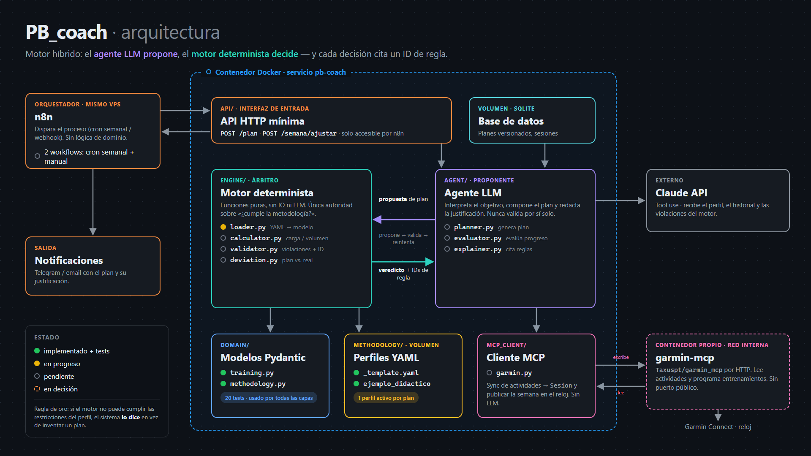

# PB_coach

Coach personal de running/trail basado en un agente de IA. Planifica ciclos
completos de entrenamiento según una metodología explícita, evalúa cada
semana lo que realmente entrené (adherencia y progreso) y ajusta lo que
viene, justificando cada decisión con el ID de la regla que la produjo.

Tiene dos modos: **construcción** (progresar sin carrera de referencia) y
**competición** (llegar en forma a una carrera). Nunca inventa metodología:
la aplica. Si no puede cumplir las restricciones, lo dice en vez de producir
un plan bonito e incoherente.

Visión completa: [`docs/vision.md`](docs/vision.md). Decisiones:
[`docs/decisions.md`](docs/decisions.md).

Este proyecto es también un ejercicio de aprendizaje de agentes de IA,
n8n y MCP.

## Principio de diseño

El sistema es un motor híbrido:

- **Motor determinista (Python)**: calcula carga/volumen/intensidad,
  valida restricciones de la metodología activa, detecta desviación entre
  plan y realidad. Es la única autoridad sobre "¿esto cumple la
  metodología?". Se testea con unit tests.
- **Agente LLM**: interpreta el objetivo del usuario, propone la
  composición de la rutina y los ajustes, evalúa el progreso en lenguaje
  natural y redacta la justificación citando el ID de regla exacto que el
  motor determinista usó. Nunca decide por sí solo si algo es válido —
  propone dentro del espacio que el motor aprueba o rechaza.

## Flujo

```
n8n ── cron semanal ──▶ POST /semana/ajustar ─┐
    └─ manual ────────▶ POST /plan ───────────┤
                                              ▼
                        pb-coach (Docker): API mínima
                          ├─ sync / publicar ◀──▶ garmin-mcp ◀──▶ Garmin
                          ├─ agente LLM (propone)
                          ├─ motor determinista (decide)
                          ├─ perfiles YAML (metodología)
                          └─ SQLite (planes versionados, sesiones)
n8n ◀── resultado ── Telegram
```



## Estructura del proyecto

```
methodology/    Perfiles de metodología (YAML), uno por autor/framework
src/pb_coach/
  domain/       Modelos de datos puros (Sesión, Mesociclo, Plan, ...)
  engine/       Motor determinista: loader, calculator, validator, deviation
  agent/        Capa LLM: planner, evaluator, explainer
  mcp_client/   Cliente MCP de garmin-mcp (sync de actividades, publicar semana)
  integrations/n8n/  Contrato de los webhooks que n8n dispara
tests/          Tests, principalmente del motor determinista
docs/           Visión, decisiones y diagramas (fuente HTML en docs/*/)
```

## Estado actual

- Hecho: modelos de dominio (`domain/training.py`, `domain/methodology.py`),
  loader de perfiles (`engine/loader.py`) y un perfil didáctico
  (`methodology/profiles/ejemplo_didactico.yaml`), todo con tests.
- Siguiente: adaptar `domain/` a la visión del 2026-10-06 (modos, tres
  niveles, sesión planificada vs. realizada, reglas de ajuste) y construir
  el motor determinista.

## Setup

```bash
pip install -e ".[dev]"
pytest
```
